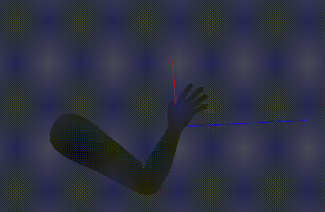
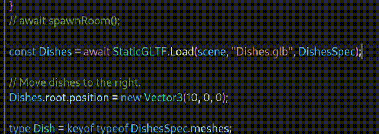

# Installation

npm install --global typescript webpack ts-loader webpack-cli html-webpack-plugin webpack-dev-server

# Showcase

Implementing an Inverse Kinematics algorithm to work on an arm model

 
Dish and cutlery stacking / filling algorithms

 
Custom function to add type magic to meshes during import to have easy autocomplete on models exported from Blender

 